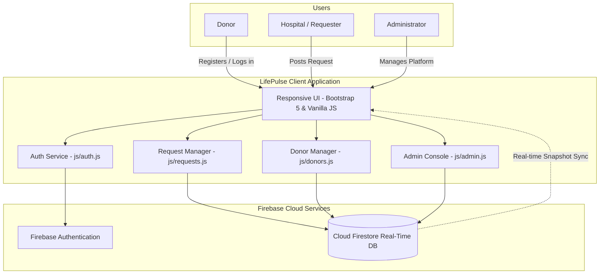

<div align="center">

# 🩸 LifePulse

### **Emergency Blood Donor & Real-Time Hospital Request Network**

[](https://github.com/nanddaya12/Life-pulse/stargazers)
[](https://github.com/nanddaya12/Life-pulse/network/members)
[](https://github.com/nanddaya12/Life-pulse/issues)
[](LICENSE)
[](https://firebase.google.com/)
[](https://getbootstrap.com/)

<p align="center">
  <b>Connecting urgent hospital blood requirements with verified nearby donors in seconds.</b><br>
  <i>Real-time updates, instant donor matching, zero delays when every heartbeat counts.</i>
</p>

[Explore Live Demo](#-getting-started) • [Report Bug](https://github.com/nanddaya12/Life-pulse/issues) • [Request Feature](https://github.com/nanddaya12/Life-pulse/issues)

</div>

---

## 📑 Table of Contents

- [About The Project](#-about-the-project)
- [Key Features](#-key-features)
- [System Architecture](#-system-architecture)
- [Tech Stack](#-tech-stack)
- [Application Pages](#-application-pages)
- [Database Schema](#-database-schema-firestore)
- [Getting Started](#-getting-started)
  - [Prerequisites](#prerequisites)
  - [Firebase Configuration](#firebase-configuration)
  - [Running Locally](#running-locally)
- [Project Directory Structure](#-project-directory-structure)
- [Contributing](#-contributing)
- [License](#-license)
- [Contact](#-contact)

---

## 🩸 About The Project

**LifePulse** is a modern emergency blood donation web platform designed to solve critical communication bottlenecks during medical emergencies. In critical healthcare scenarios, locating compatible donors for rare blood types or urgent surgical transfusions can consume precious minutes.

LifePulse streamlines this workflow by enabling:
1. **Hospitals & Families** to broadcast urgent, categorized blood requests.
2. **Voluntary Donors** to register their blood group, location, and real-time availability.
3. **Medical Administrators** to monitor requests, verify donors, and mark fulfilled supplies across the network.

---

## ✨ Key Features

- ⚡ **Real-Time Emergency Feed**: Powered by Cloud Firestore real-time listeners (`onSnapshot`), requests appear across all connected devices instantly without page reloads.
- 🩸 **Comprehensive Donor Registry**: Donors can register with blood group compatibility (`A+`, `A-`, `B+`, `B-`, `AB+`, `AB-`, `O+`, `O-`), contact details, and location.
- 🚨 **Multi-Tier Urgency Categorization**: Requests support tiered urgency badges (`Critical`, `High`, `Normal`) with unit counters and hospital contact details.
- 🛡️ **Role-Based Admin Console**: Dedicated verification dashboard for administrators to approve requests, resolve emergencies, and maintain donor pools.
- 🔐 **Firebase Authentication**: Integrated email & password authentication for secure access management.
- 🎨 **Modern Glassmorphic UI**: Sleek, mobile-first design with smooth micro-interactions, custom Crimson emergency color palette, and Bootstrap 5 responsiveness.
- 🔔 **Custom Dynamic Toasts**: Non-intrusive notification system for real-time user feedback during registrations and requests.

---

## 🏗️ System Architecture



---

## 🛠️ Tech Stack

| Layer | Technology | Description |
| :--- | :--- | :--- |
| **Frontend Framework** | HTML5, CSS3, JavaScript (ES6 Modules) | Fast, dependency-free vanilla architecture |
| **CSS Framework** | [Bootstrap 5.3.3](https://getbootstrap.com/) | Responsive grid, modern utilities, and components |
| **Iconography** | [Bootstrap Icons 1.11.3](https://icons.getbootstrap.com/) | Clean vector icon set |
| **Authentication** | [Firebase Auth](https://firebase.google.com/docs/auth) | Secure client-side credential management |
| **Database** | [Cloud Firestore](https://firebase.google.com/docs/firestore) | NoSQL real-time document database |
| **Styling Concept** | Custom Crimson Glassmorphism | Professional healthcare aesthetic with subtle backdrop filters |

---

## 📄 Application Pages

| File | Page Name | Functionality |
| :--- | :--- | :--- |
| [`index.html`](index.html) | **Home & Landing** | Hero section, impact statistics, how-it-works workflow, call-to-actions. |
| [`dashboard.html`](dashboard.html) | **Live Emergency Feed** | Real-time synchronized active emergency requests feed with urgency indicators. |
| [`register.html`](register.html) | **Donor Registration** | Blood group selection, contact info, city/location, and availability status. |
| [`request.html`](request.html) | **Emergency Blood Request** | Form to submit hospital requirements, urgency level, units needed, and patient contact. |
| [`login.html`](login.html) | **Authentication** | User and administrator sign-in portal. |
| [`admin.html`](admin.html) | **Admin Console** | Complete platform oversight, donor verification, and request lifecycle management. |
| [`404.html`](404.html) | **Error Page** | Custom branded fallback for missing routes. |

---

## 🗄️ Database Schema (Firestore)

### 1. `donors` Collection
```json
{
  "fullName": "Sarah Jenkins",
  "email": "sarah.j@example.com",
  "phone": "+1-555-0199",
  "bloodGroup": "O+",
  "city": "Metro City",
  "status": "Available",
  "createdAt": "2026-09-22T10:00:00Z"
}
```

### 2. `requests` Collection
```json
{
  "patientName": "David Miller",
  "bloodGroup": "B-",
  "hospital": "City Memorial Hospital",
  "units": 2,
  "urgency": "Critical",
  "contactPhone": "+1-555-0144",
  "status": "Active",
  "createdAt": "2026-09-22T10:30:00Z"
}
```

---

## 🚀 Getting Started

Follow these steps to get a local copy up and running.

### Prerequisites

You only need a modern web browser and a lightweight local HTTP server (such as VS Code Live Server, Node.js `serve`, or Python).

### Firebase Configuration

1. Visit the [Firebase Console](https://console.firebase.google.com/) and create a new project.
2. Enable **Authentication** (Email/Password provider).
3. Create a **Firestore Database** in test or production mode.
4. Add a Web App to your Firebase project and copy your credentials.
5. Open [`js/firebase-config.js`](js/firebase-config.js) and replace the placeholders:

```javascript
const firebaseConfig = {
  apiKey: "YOUR_FIREBASE_API_KEY",
  authDomain: "YOUR_PROJECT_ID.firebaseapp.com",
  projectId: "YOUR_PROJECT_ID",
  storageBucket: "YOUR_PROJECT_ID.appspot.com",
  messagingSenderId: "YOUR_MESSAGING_SENDER_ID",
  appId: "YOUR_APP_ID"
};
```

### Running Locally

Clone the repository:
```bash
git clone https://github.com/nanddaya12/Life-pulse.git
cd Life-pulse
```

Serve the project using your preferred method:

#### Option A: Using Python
```bash
# Python 3.x
python -m http.server 3000
```
Open [http://localhost:3000](http://localhost:3000) in your browser.

#### Option B: Using Node.js (`npx serve`)
```bash
npx serve .
```

#### Option C: Using VS Code Live Server
Right-click on `index.html` inside VS Code and select **"Open with Live Server"**.

---

## 📁 Project Directory Structure

```text
Life-pulse/
├── .gitignore              # Ignored files and directories
├── README.md               # Project documentation
├── index.html              # Homepage & landing portal
├── dashboard.html          # Real-time live emergency requests feed
├── register.html           # Donor registration portal
├── request.html            # Blood request submission form
├── login.html              # User / Admin authentication page
├── admin.html              # Administrator management console
├── 404.html                # Custom error 404 page
├── css/
│   └── style.css           # Custom crimson styling, glassmorphism, responsive styles
├── js/
│   ├── firebase-config.js  # Firebase SDK initialization & configuration
│   ├── auth.js             # User login, registration, and session management
│   ├── dashboard.js        # Real-time Firestore query listener for emergency feed
│   ├── donors.js           # Donor submission logic & validation
│   ├── requests.js         # Emergency request publishing & handling
│   ├── admin.js            # Management actions (fulfill, delete, verify)
│   └── toast.js            # Custom UI toast notifications
└── images/
    └── blood_bg.jpg        # Healthcare & emergency visual assets
```

---

## 🤝 Contributing

Contributions are what make the open source community such an amazing place to learn, inspire, and create. Any contributions you make are **greatly appreciated**.

1. Fork the Project
2. Create your Feature Branch (`git checkout -b feature/AmazingFeature`)
3. Commit your Changes (`git commit -m 'Add some AmazingFeature'`)
4. Push to the Branch (`git push origin feature/AmazingFeature`)
5. Open a Pull Request

---

## 📜 License

Distributed under the MIT License. See `LICENSE` for more information.

---

## 📬 Contact

**Nand Daya** - [GitHub Profile](https://github.com/nanddaya12)

Project Link: [https://github.com/nanddaya12/Life-pulse](https://github.com/nanddaya12/Life-pulse)

<div align="center">
  <sub>Made with ❤️ to save lives through real-time technology.</sub>
</div>
